# SD-RefDrop
This is an extension to implement multiple nodes for [ComfyUI](https://github.com/lllyasviel/stable-diffusion-webui-forge). (Find the reForge version of this extension [here](https://github.com/tocantrell/sd-refdrop) and the Forge version [here](https://github.com/tocantrell/sd-refdrop-forge). Its purpose is to implement RefDrop image consistency based on [RefDrop: Controllable Consistency in Image or Video Generation via Reference Feature Guidance](https://arxiv.org/abs/2405.17661) (Fan et al. 2024). RefDrop allows for either consistency or diversification of diffusion model outputs based on an intially recorded output. 

For real-world application purposes, you can find a prompt and a seed with an output character or scene that you like and then apply aspects of that character to all future outputs. Alternatively you can also similarly find a seed with features you want to avoid and remove aspects of that image in future outputs. This level of consistency or diversification is controlled by the RFG Coefficent, which is a parameter that ranges from -1 to 1. Positive values force the outputs to be similar to the initial image while negative values ensure differences. It seems to work best in the 0.2 to 0.6 range for consistency or -0.2 to -0.3 range for diversification.

## Examples
The "Original" images were generated using a random seed, and then following images were made with a singular different seed. For the different seed a slight change was made to the prompt, denoted in brackets below:
```
Positive prompt:
score_9,score_8_up,score_7_up,
1girl,simple hoodie, jeans, solo,
light smile, [dancing,][library, studying,]
ponytail,looking at viewer,grey_background,wide_shot

Negative prompt:
score_6, score_5, score_4,
graphic t-shirt,
```
All were generated at 512x768 at CFG 7 using `Euler a` with 20 sampling steps. For this first set, all images were made using the WAI-CUTE-v6.0 fine tune of SDXL.

|   Original |    Dancing | Consistent |  Diversify |
| ------------ | ------------ | ------------ | ------------ |
| 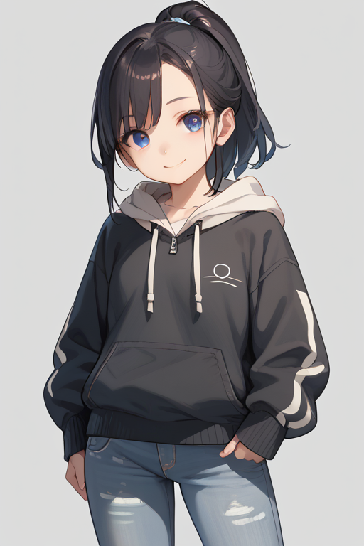 | 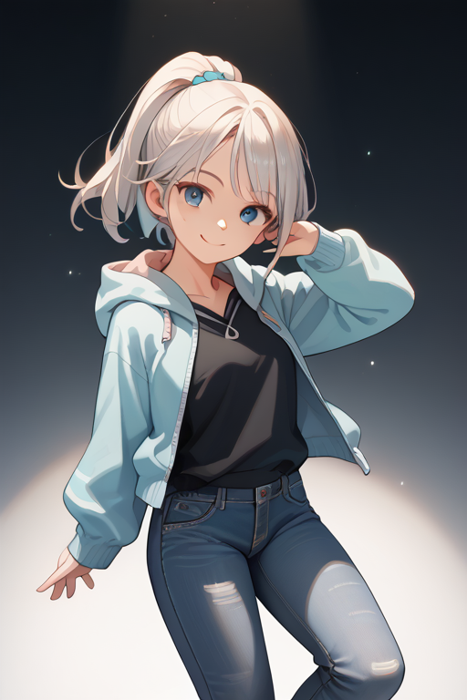 | 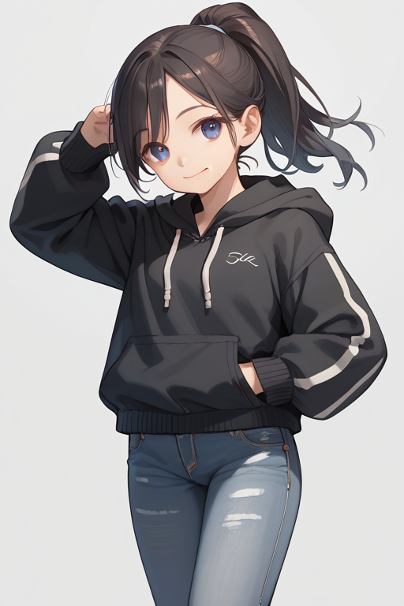 | 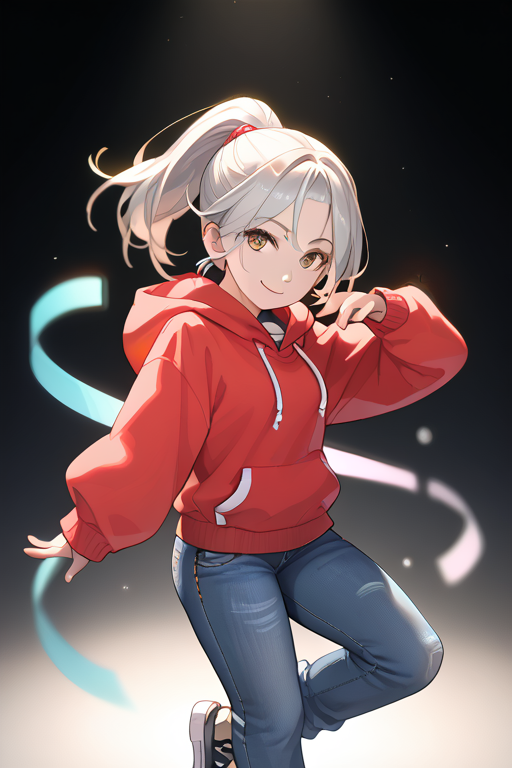 |

|   Original |   Studying | Consistent |  Diversify |
| ------------ | ------------ | ------------ | ------------ |
|  |  |  |  |

The following images use the same original saved output, but then are merged or diversified with using a separate, realistic fine tuned SDXL model. In practice, I've seen how this method can apply unrealistic aspects to a model trained on photos via consistency or emphasize the details and realism of an output using a negative RFG coefficent from an initial input from a less detailed model. The authors of the original paper also showed how this output diversification method can be used to help overcome stereotypes the model may have learned.

|   Original |   Studying | Consistent |  Diversify |
| ------------ | ------------ | ------------ | ------------ |
|  |  | 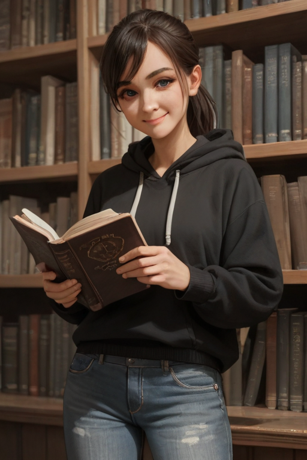 |  |

## Usage Guide
I recommend installing by using the [ComfyUI Manager](https://github.com/ltdrdata/ComfyUI-Manager). Within the ComfyUI Manager Menu, click Custom Nodes Manager and then Install via Git URL at the bottom. After refreshing ComfyUI, you will now have access to five new nodes under the `RefDrop` custom node category. Most users should stick with the `RefDrop Combined` node, but there are separate nodes for the `Save` and `Use` if you have a particular use case. Below is a basic workflow example.

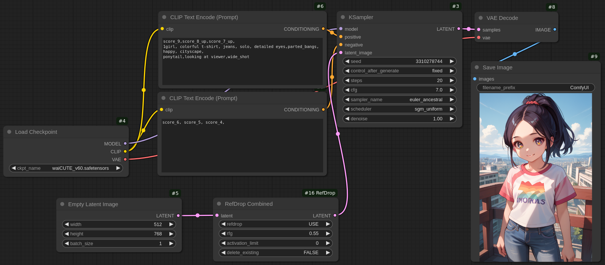

First, insert the RefDrop node(s) between the `Empty Latent Image` node and the `KSampler`. You will never need to make multiple copies of a RefDrop node, because this implementation only alters the ComfyUI's underlying attention network implementation code. Unlike most ComfyUI nodes, it doesn't actually take any inputs or return any outputs. Once the node is placed, find a specific image you want to use as the base for consistency or diversification. After you've found the single image output you'll use, save its seed by changing the `KSampler` node's `control_after_generate` option to 'fixed'. Click `Save` from the from the first option of the RefDrop node. The RFG Coefficient doesn't matter for this first step, because at this point we are only saving the network details about the base image. All data is stored in your computer's RAM (not VRAM).

> [!WARNING]
> If you are generating a large image or have a long workflow then be sure to set the `activation_limit` to something like 2000 or 3000 depending on how much system memory your computer has.

> [!TIP]
> This extension only saves one base image data at a time. If you have multiple images you care about, it might be easiest to save the details of the prompt and seed and rerun the `Save` step as needed. My Automatic1111-based implementations can save the activation data to disk, but it has not been implemented for ComfyUI.

After the save step finishes and you have recreated the original image you want to use for the process, you can now switch the node's first option to `Use` and set the RFG coefficent as described earlier. While `Enabled` is selected all outputs will use RefDrop.

> [!IMPORTANT]
> When generating new images using RefDrop, the network parameters must be the same as the original saved image. In practical terms, this means only use models from the same lineage (for example, if using SD1.5 for the base image, only use SD1.5 fine tunes for the output). This RefDrop implementation will use the activation data available from the `Save` step and then continue on as normal. I have not seen any issues with changing the height, width, sampling method, etc. between `Save` and `Use`.

For users that want more control over the output, I've added "Advanced" nodes. These options allow you to select specific parts of the attention U-net to disable RefDrop. For example, the authors of the original paper tested disabled RefDrop from the first layer of the output U-net in order to limit the consistency on pose and background in the outputs. Below is one visual example of how this advanced node works in practice.
```
Positive prompts:
score_9,score_8_up,score_7_up,
1girl, colorful t-shirt, jeans, solo, detailed eyes,parted_bangs,
[1:angry, frown, mountains,] [2:happy, cityscape,]
ponytail,looking at viewer,wide_shot

Negative prompt:
score_6, score_5, score_4,
```

|   Original |   Disabled | Enabled |  Advanced  |
| ------------ | ------------ | ------------ | ------------ |
| 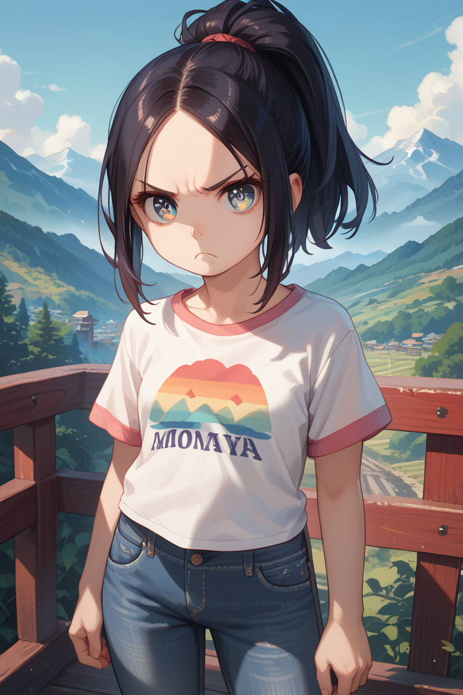 | 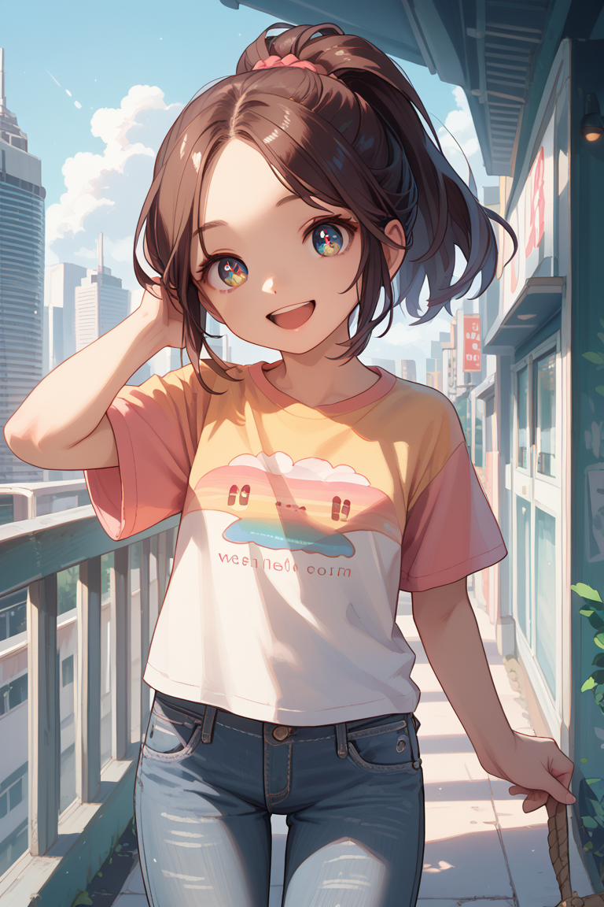 | 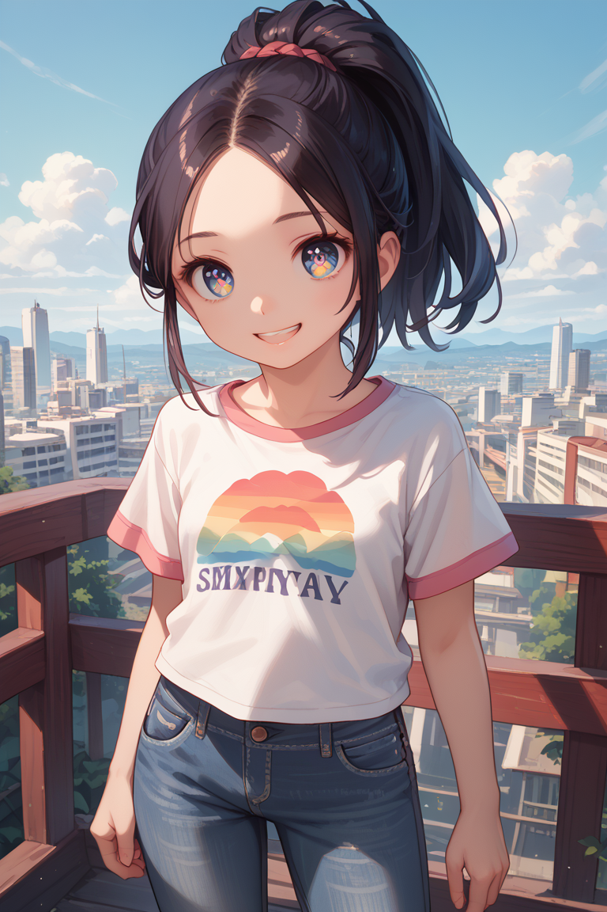 | 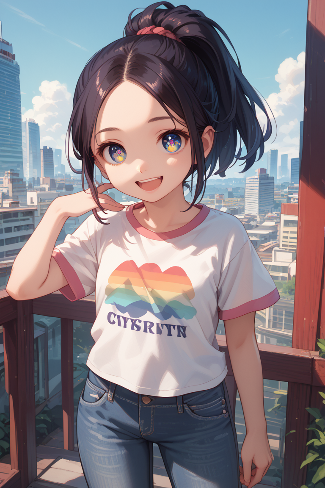 |

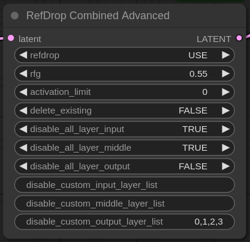

## Afterword
A big thank you to the author of this paper for coming up with the idea and taking the time to talk with me about it at NeurIPS 2024. There is a lot left to explore in this area, including applicability to other areas such as video. One important point that needs to be addressed for this implementation is figuring out how to prune what needs to be saved in order to acheive the desired results. The current implementation is saving all K and V values that are created at any point during the image generation, which is probably overkill.
